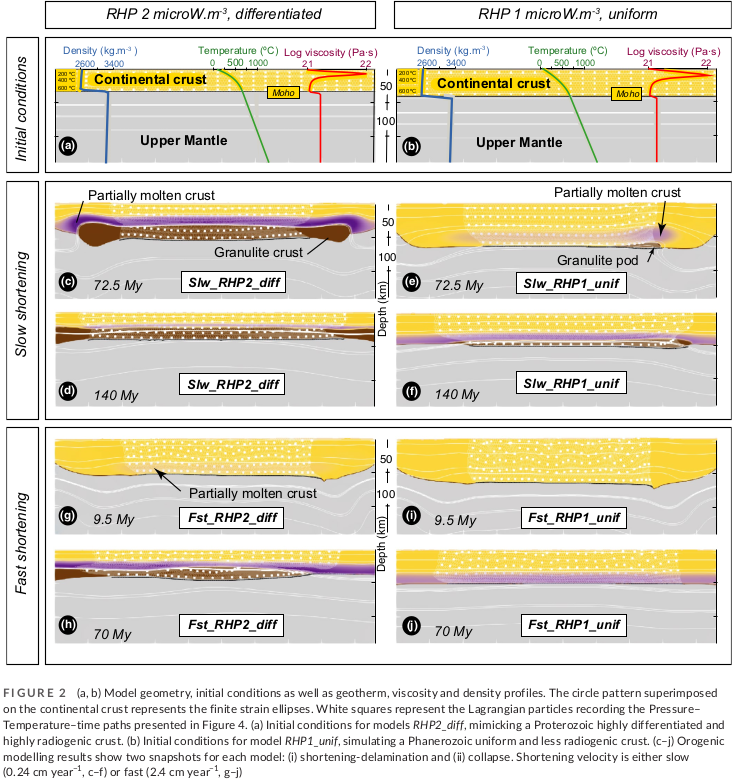

<table>
 <tr>
  <td></td>
 </tr>
</table>

https://doi.org/10.1111/ter.12577

Abstract
-----
Long-lived high to ultra-high temperature (HT-UHT) granulitic terranes formed throughout Earth's history. Yet, the detailed processes involved in their formation remain unresolved and notably the sequence of appearance and duration of migmatisation and granulites conditions in the orogenic cycle. These processes can be evaluated by analytical and numerical models. First, solving the steady-state heat equation allows underlining the interdependency of the parameters controlling the crustal geotherm at thermal equilibrium. Second, performing two-dimensional thermo-mechanical experiments of an orogenic cycle, from shortening to gravitational collapse, allows to consider non-steady-state geotherms and understand how deformation velocity may affect the relative timing of migmatite and granulite formation. These numerical experiments with elevated radiogenic heat production and slow shortening rates allow the formation of large volumes of prograde migmatites and granulites going through the sillimanite field as observed in many HT-UHT terranes. Finally, the interplay between these parameters can explain the difference in predicted pressure-temperature-time paths that can be compared with the natural rock archive.

Files
-----

File | Purpose
--- | ---
`Script_ter12577_Cenki-etal_2022.ipynb` | Input file script.
`Cenkietal_SupplementaryData.pdf` | Supplementary data of the model.

Tests
-----

Parallel Safe
-------------
Yes
